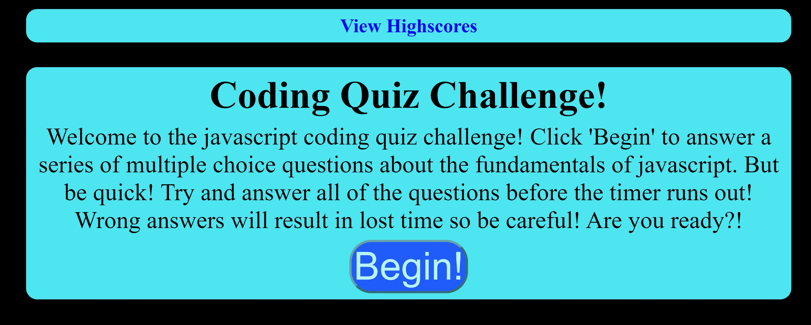

# Code-Quiz

## Description

Created an application that quizes users on their vanilla javascript knowledge and awards points based on how quickly they answer. Users may then enter their initials if they make the top ten.

## Installation

Download repository from https://github.com/kevinchewning/Code-Quiz

## Usage

Site can be viewed at https://kevinchewning.github.io/Code-Quiz/

<<<<<<< HEAD

=======

>>>>>>> c1bf53501640a48e852e05cc2d33d73fbc360a6f

## Credits

Kevin Chewning https://github.com/kevinchewning
